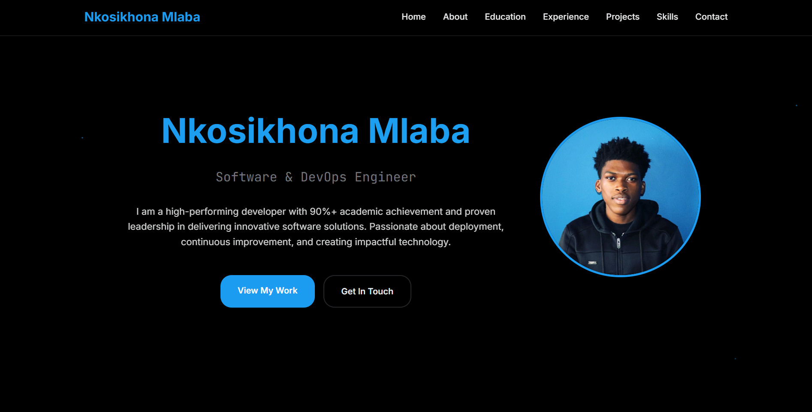

# Minimal-Website
An implementation of a website that contains information about me and projects I have worked on.

## View the live site here: [Portfolio](https://nkosimlaba.github.io/Portfolio-website/)

## System Requirements:
- An operating system with a web browser installed
- Javascript must be enabled in the chosen web browser

## Getting Started
1. Clone the repository
2. Open the project folder in your preferred code editor

## Setup:
1. Install a web browser

## Running the program
1. Run `index.html` in your web browser

## How to use the program
1. Visit the website, view the content

## Features

- Multiple pages, each containing different content
- Responsive design for various screen sizes
- Interactive elements
- Media queries for responsive design
- Slideshow for showcasing images

## Contributor

Nkosikhona Mlaba

## License

This project is licensed under the MIT License.